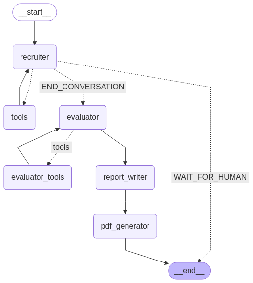

# Talent Talk

An AI-powered interview system that conducts technical interviews, evaluates responses, and generates comprehensive reports.



<p align="center">
  <em>Revolutionizing technical interviews with AI-driven conversations and insights</em>
</p>

## Features

- **Multiple Interview Modes**: Text-based or voice-based interviews
- **Dynamic Resume Analysis**: Upload any resume for personalized questions
- **Customizable Questions**: Upload your own interview questions
- **Voice Interaction**: Speak with the AI interviewer using Whisper (local) or AssemblyAI (cloud)
- **Automatic Evaluation**: Get detailed scoring and feedback on interview performance
- **Report Generation**: Comprehensive HR reports with candidate assessment
- **PDF Export**: Download professional PDF reports

## Components

- **LangGraph Workflow**: Multi-stage interview process with evaluation and reporting
- **Speech-to-Text**: Local (Whisper) or cloud-based (AssemblyAI) options
- **Text-to-Speech**: Voice responses using ElevenLabs
- **Vector Search**: Dynamic resume and question analysis
- **PDF Generation**: Professional report formatting and export

## Installation

1. Clone the repository:
```bash
git clone https://github.com/yourusername/talent-talk.git
cd talent-talk
```

2. Install dependencies:
```bash
pip install -r requirements.txt
```

3. Set up environment variables:
```bash
cp .env.example .env
# Edit .env with your API keys
```

## Usage

### Text-based Interview
```bash
streamlit run text_interview_app.py
```

### Voice-based Interview with Whisper (Local)
```bash
streamlit run voice_interview_app_whisper.py
```

### Voice-based Interview with AssemblyAI (Cloud)
```bash
streamlit run voice_interview_app_assemblyai.py
```

## Interview Process

1. **Setup**: Configure interview parameters and upload resume/questions
2. **Introduction**: AI introduces itself and asks candidate to introduce themselves
3. **Resume Questions**: AI asks about specific projects from the candidate's resume
4. **Technical Questions**: AI asks technical questions related to the position
5. **Follow-up Questions**: AI may ask follow-up questions for incomplete answers
6. **Evaluation**: After the interview, AI evaluates the candidate's responses
7. **Report Generation**: AI creates a comprehensive HR report
8. **PDF Export**: Download the report as a professional PDF

## Configuration Options

- **Interviewer Mode**: friendly, formal, or technical
- **Position**: Job title for the interview
- **Company Name**: Company conducting the interview
- **Number of Questions**: How many technical questions to ask
- **Follow-up Questions**: How many follow-up questions to ask
- **Voice Settings**: Model size and language options (for Whisper)

## API Keys

This project uses the following external APIs:

- **AssemblyAI**: For cloud-based speech recognition
- **ElevenLabs**: For realistic AI voice responses
- **Google Generative AI**: For the LLM powering the interview

## Directory Structure

```
talent-talk/
├── src/                    # Core source code
│   ├── workflow.py         # Basic workflow implementation
│   ├── dynamic_workflow.py # Enhanced workflow with dynamic resume
│   └── pdf_utils.py        # PDF generation utilities
├── utils/                  # Utility functions
│   └── audio_utils.py      # Audio processing utilities
├── data/                   # Default data files
│   ├── default_questions.pdf  # Default interview questions
│   └── default_resume.pdf     # Default resume for testing
├── generated_reports/      # Generated PDF reports
├── uploaded_resumes/       # User-uploaded resumes
├── uploaded_questions/     # User-uploaded questions
├── text_interview_app.py   # Text-based interview app
├── voice_interview_app_whisper.py    # Voice app with Whisper
├── voice_interview_app_assemblyai.py # Voice app with AssemblyAI
├── requirements.txt        # Project dependencies
├── .env.example            # Example environment variables
├── .gitignore              # Git ignore file
└── README.md               # Project documentation
```

## Requirements

- Python 3.8+
- Streamlit
- LangGraph
- LangChain
- Google Generative AI
- Whisper (for local voice processing)
- AssemblyAI (for cloud voice processing)
- ElevenLabs (for voice responses)
- FPDF (for PDF generation)

## License

[MIT](LICENSE)

## Acknowledgments

- OpenAI for Whisper
- AssemblyAI for speech recognition
- ElevenLabs for text-to-speech
- LangChain and LangGraph for the agent framework